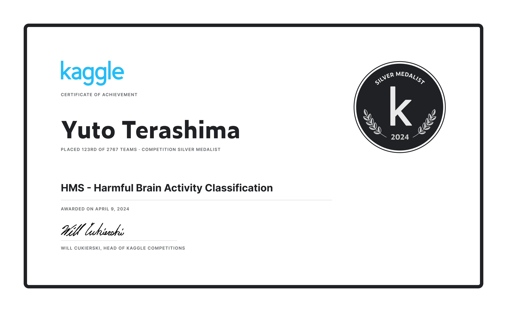

# HMS Harmful Brain Activity Classification

Kaggle Silver Medal solution archive and reproducible research package for the
[HMS - Harmful Brain Activity Classification](https://www.kaggle.com/competitions/hms-harmful-brain-activity-classification)
competition.



**Result:** 123rd of 2,767 teams, Kaggle Competition Silver Medalist, awarded April 9, 2024.

## Why This Matters

The competition asks models to classify harmful brain activity patterns from EEG data collected in
critically ill hospital patients. The target distribution covers six clinically important classes:
`seizure`, `LPD`, `GPD`, `LRDA`, `GRDA`, and `other`. The solution combines spectrogram-based
computer vision models with a raw EEG sequence model, then blends the models to produce calibrated
probability submissions for the competition metric.

This repository is organized as both an archive of the original Kaggle notebooks and a cleaner
engineering package for reproducibility, review, and extension.

```mermaid
flowchart LR
    A["Kaggle EEG + spectrogram data"] --> B["Model 1: EfficientNet-B0 with official + generated spectrograms"]
    A --> C["Model 2: ResNet1D-GRU over raw EEG"]
    A --> D["Model 3: EfficientNet baseline over official spectrograms"]
    B --> E["OOF validation and test probabilities"]
    C --> E
    D --> E
    E --> F["Weighted ensemble submission"]
```



## Repository Map

| Path | Purpose |
| --- | --- |
| `notebooks/original/` | Original Kaggle notebooks from the submitted solution archive. |
| `src/hms_solution/` | Reusable preprocessing, model, training, inference, metric, and ensemble code. |
| `scripts/` | Reproducible CLI entrypoints for download, metadata preparation, training, inference, and blending. |
| `configs/` | Model and ensemble configurations. |
| `reports/` | Method report, data card, reproduction notes, and experiment summary. |
| `assets/` | Certificate and generated project visuals. |
| `tests/` | Smoke tests for notebooks, configs, synthetic inference, and ensemble formatting. |

## Solution Components

| Component | Input | Model family | Role |
| --- | --- | --- | --- |
| Model 1 | Official spectrograms + generated EEG spectrograms | EfficientNet-B0 style 2D CNN | Primary model family; strongest individual contributor in the original archive. |
| Model 2 | Raw EEG waveforms | ResNet1D + GRU | Captures temporal waveform structure not visible in fixed spectrogram features. |
| Model 3 | Official spectrograms only | EfficientNet-B0/B1 style 2D CNN | Stable auxiliary model for diversity and blending. |
| Ensemble | Three probability files | Weighted average | Reduces model-specific failure modes and improves calibration. |

The original archive notes that Model 1 performed best individually, followed by Model 2 and Model 3,
with the full Model 1 + Model 2 + Model 3 blend producing the best final system.

## Quick Start

Install the package in an environment with PyTorch and the usual scientific stack:

```powershell
python -m pip install -e ".[dev,gpu]"
```

Run the fast synthetic smoke tests:

```powershell
pytest
python scripts/train_model1.py --config configs/model1_effnet_spectrogram.yaml --device cpu --smoke
python scripts/train_model2.py --config configs/model2_resnet1d_gru.yaml --device cpu --smoke
python scripts/train_model3.py --config configs/model3_effnet_official_spec.yaml --device cpu --smoke
python scripts/run_inference.py --device cpu --smoke --out reports/results/smoke_submission.csv
python scripts/blend_submissions.py --config configs/ensemble.yaml --smoke
```

For a GPU run:

```powershell
python scripts/train_model1.py --config configs/model1_effnet_spectrogram.yaml --device cuda
python scripts/train_model2.py --config configs/model2_resnet1d_gru.yaml --device cuda
python scripts/train_model3.py --config configs/model3_effnet_official_spec.yaml --device cuda
```

## Data Access

Raw Kaggle competition files are not committed to this repository. After accepting the Kaggle
competition rules and configuring Kaggle credentials, download data with:

```powershell
python scripts/download_data.py --competition hms-harmful-brain-activity-classification --data-dir data/raw
python scripts/prepare_metadata.py --data-dir data/raw --out-dir data/processed
```

The metadata script creates label distributions, sample manifests, and reproducibility summaries
when `train.csv` is available. Without Kaggle credentials, the repository still includes public
competition context and synthetic smoke paths for code review.

## Reports

- [Method Report](reports/method_report.md)
- [Experiment Summary](reports/experiment_summary.md)
- [Data Card](reports/data_card.md)
- [Reproduction Notes](reports/reproduction_notes.md)

## Original Notebook Archive

The submitted materials are preserved under `notebooks/original/`:

- `model1/eeg_gen_spec.ipynb`
- `model1/train_eff0_stage1.ipynb`
- `model1/train_eff0_stage2.ipynb`
- `model1/infer.ipynb`
- `model2/hms-resnet1d-gru-train.ipynb`
- `model2/hms-resnet1d-gru-infer.ipynb`
- `model3/hms-eff1-train-stage1.ipynb`
- `model3/hms-eff1-train-stage2.ipynb`
- `model3/hms-infer.ipynb`

## Limitations

- Kaggle test labels are not public, so this repository documents the final medal outcome and
  provides local validation tooling rather than claiming hidden-test reproduction.
- Raw competition parquet files and model checkpoints are intentionally excluded from Git.
- Medical AI systems require external validation, calibration review, and clinician oversight before
  any real clinical use.

