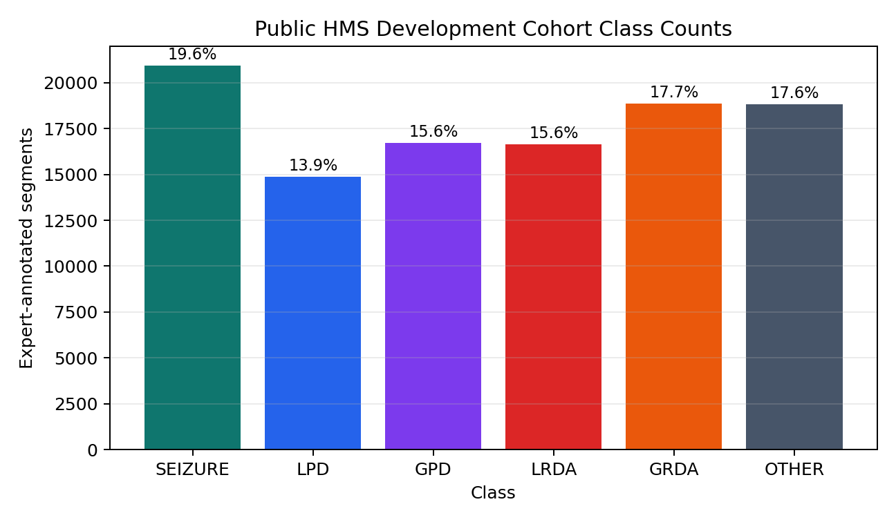

# Experiment Summary

## Verified Local Materials

The local archive contains three model families and a Kaggle certificate:

| Item | Evidence |
| --- | --- |
| Model 1 | EfficientNet-B0 spectrogram notebooks with generated EEG spectrogram workflow. |
| Model 2 | ResNet1D-GRU raw EEG train and inference notebooks. |
| Model 3 | EfficientNet spectrogram train and inference notebooks. |
| Award | Certificate image: 123rd of 2,767 teams, Silver Medal, awarded April 9, 2024. |

## Public Competition Context

The task is six-way harmful brain activity classification from EEG signals. Publicly available
competition and study summaries describe the data as EEG and spectrogram inputs annotated by expert
reviewers for seizure, LPD, GPD, LRDA, GRDA, and other activity. The Kaggle hidden test labels are
not released, so this repository focuses on method documentation and local reproducibility.

## Model Comparison

| Model | Signal view | Strength | Risk |
| --- | --- | --- | --- |
| Model 1 | Official + generated spectrograms | Best individual model noted in the archive. | Sensitive to spectrogram generation and augmentation choices. |
| Model 2 | Raw EEG | Adds temporal waveform diversity. | More memory-sensitive and preprocessing-sensitive. |
| Model 3 | Official spectrograms | Simpler auxiliary model with stable inputs. | Lower standalone diversity than generated features. |
| Ensemble | Blended probabilities | Combines complementary views. | Needs careful validation to avoid overweighting correlated errors. |

## Reproducible Artifacts in This Repo

- `reports/results/model_family_summary.csv`
- `reports/results/public_development_class_counts.csv`
- `data/processed/public_development_class_counts.csv`
- synthetic smoke outputs generated by `scripts/train_model*.py --smoke`
- notebook integrity tests under `tests/`

## Local CUDA Smoke Run

These smoke runs validate model construction, forward/backward passes, KL-divergence training, and
submission formatting on the local CUDA-enabled environment. They are not leaderboard metrics.

| Script | Device | CUDA available | Steps | Final synthetic KL loss | Parameters |
| --- | --- | --- | ---: | ---: | ---: |
| `train_model1.py --smoke` | cuda | true | 2 | 0.2131 | 23,910 |
| `train_model2.py --smoke` | cuda | true | 2 | 0.0742 | 395,814 |
| `train_model3.py --smoke` | cuda | true | 2 | 0.2138 | 23,910 |

## What Requires Kaggle Credentials

The following are intentionally generated locally after the user accepts Kaggle rules:

- exact `train.csv` label distribution
- per-patient or per-spectrogram manifests
- fold-level validation tables
- full model checkpoints
- OOF predictions and final local ensemble files
